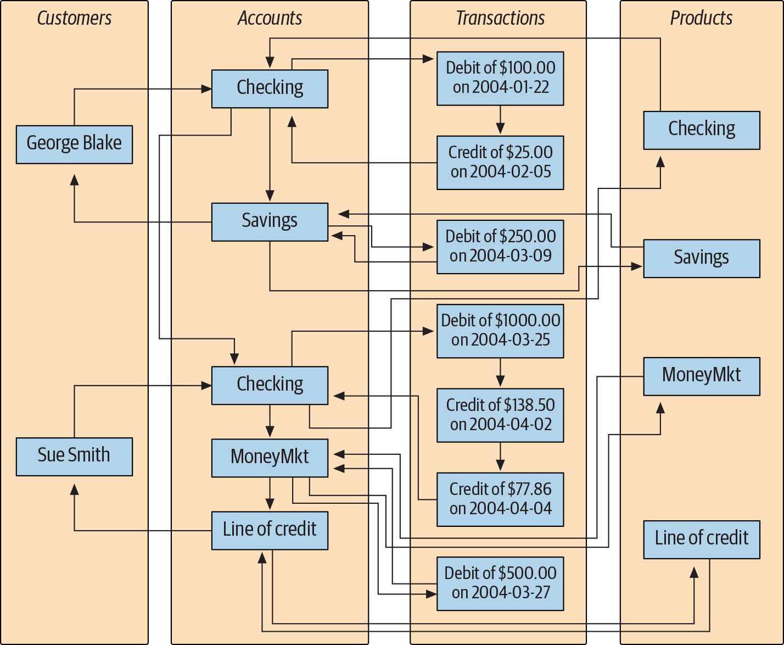

# Chapter 1 - A Little Background
A database is nothing more than a set of related information.

## Nonrelational Database Systems
Over the first several decades of computerized database systems, data was stored and represented to users in various ways. In a *hierarchical database system*, for example, data is represented as one or more tree structures.

Another common approach, called the *network database system*, exposes sets of records and sets of links that define relationships between different records.

In order to find the transactions posted to Sue’s money market account, you would need to perform the following steps:
1. Find the customer record for Sue Smith.
2. Follow the link from Sue Smith’s customer record to her list of accounts.
3. Traverse the chain of accounts until you find the money market account.
4. Follow the link from the money market record to its list of transactions.

Both hierarchical and network database systems are alive and well today, although generally in the mainframe world. however, a new way of representing data began to take root, one that was more rigorous yet easy to understand and implement.

## The Relational Model
In 1970, Dr. E. F. Codd of IBM’s research laboratory published a paper titled “A Relational Model of Data for Large Shared Data Banks” that proposed that data be represented as sets of *tables*. Rather than using pointers to navigate between related entities, redundant data is used to link records in different tables.

The number of columns that a table may contain differs from server to server, but it is generally large enough not to be an issue. The number of rows that a table may contain is more a matter of physical limits and maintainability than of database server limitations.

Each table in a relational database includes information that uniquely identifies a row in that table (known as the primary key), along with additional information needed to describe the entity completely.

Some of the tables also include information used to navigate to another table; this is where the “redundant data” mentioned earlier comes in.

These columns are known as foreign keys, and they serve the same purpose as the lines that connect the entities in the hierarchical and network versions of the account information.

It might seem wasteful to store the same data many times, but the relational model is quite clear on what redundant data may be stored. For example, it is proper for the table to include a column for the unique identifier of the customer who account opened the account, but it is not proper to include the customer’s first and last names in the table as well. If a customer were to change her name, for example, you account want to make sure that there is only one place in the database that holds the customer’s name; otherwise, the data might be changed in one place but not another, causing the data in the database to be unreliable.

## Some Terminology

## What Is SQL?
Along with Codd’s definition of the relational model, he proposed a language called DSL/Alpha for manipulating the data in relational tables. Shortly after Codd’s paper was released, IBM commissioned a group to build a prototype based on Codd’s ideas. This group created a simplified version of DSL/Alpha that they called SQUARE. Refinements to SQUARE led to a language called SEQUEL, which was, finally, shortened to SQL.
SQL began as a language used to manipulate data in relational databases.

SQL goes hand in hand with the relational model because the result of an SQL query is a table.

## SQL Statement Classes
The SQL language is divided into several distinct parts include:
- *SQL schema statements*, which are used to define the data structures stored in the database.
- *SQL data statements*, which are used to manipulate the data structures previously defined using SQL schema statements.
- *SQL transaction statements*, which are used to begin, end, and roll back transactions.

All database elements created via SQL schema statements are stored in a special set of tables called the data dictionary.

## SQL: A Nonprocedural Language
If you have worked with programming languages in the past, you are used to defining variables and data structures, using conditional logic (i.e., if-then-else) and looping constructs (i.e., do while ... end), and breaking your code into small, reusable pieces (i.e., objects, functions, procedures). Your code is handed to a compiler, and the executable that results does exactly (well, not always exactly) what you programmed it to do. Whether you work with Java, Python, Scala, or some other procedural language, you are in complete control of what the program does. With SQL, however, you will need to give up some of the control you are used to,
because SQL statements define the necessary inputs and outputs, but the manner in which a statement is executed is left to a component of your database engine known as the optimizer. The optimizer’s job is to look at your SQL statements and, taking into account how your tables are configured and what indexes are available, decide the most efficient execution path. Most database engines will allow you to influence the optimizer’s decisions by specifying *optimizer hints*, such as suggesting that a particular index be used.