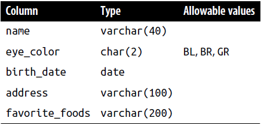

# Chapter 1 - Creating and Populating a Database
## MySQL Data Types
In general, all the popular database servers have the capacity to store the same types of data, such as strings, dates, and numbers.
### Character Data
Character data can be stored as either fixed-length or variable-length strings.
When defining a character column, you must specify the maximum size of any string to be stored in the column. For example, if you want to store strings up to 20 characters in length, you could use either of the following definitions:
```sql
char(20) /* fixed-length */
varchar(20) /* variable-length */
```
The maximum length for *char* columns is currently 255 bytes, whereas *varchar* columns can be up to 65,535 bytes. If you need to store longer strings (such as emails, XML documents, etc.), then you will want to use one of the text types (mediumtext and longtext).

#### Character sets
For languages that use the Latin alphabet, such as English, there is a sufficiently small number of characters such that only a single byte is needed to store each character. Other languages, such as Japanese and Korean, contain large numbers of characters, thus requiring multiple bytes of storage for each character. Such character sets are therefore called multibyte character sets.
MySQL can store data using various character sets, both single- and multibyte. To view the supported character sets in your server, you can use the *show* command.
```sql
SHOW CHARACTER SET;
```
In prior versions of the MySQL server, the *latin1* character set was automatically chosen as the default character set, but version 8 defaults to *utf8mb4*.

To choose a character set other than the default when defining a column, simply name one of the supported character sets after the type definition, as in:
```sql
varchar(20) character set latin1
```
#### Text data
If you need to store data that might exceed the 64 KB limit for *varchar* columns, you will need to use one of the text types.

Now that MySQL allows up to 65,535 bytes for *varchar* columns (it was limited to 255 bytes in version 4), there isn’t any particular need to use the *tinytext* or *text* type.

If you are creating a column for free-form data entry, such as a *notes* column to hold data about customer interactions with your company’s customer service department, then *varchar* will probably be adequate. If you are storing documents, however, you should choose either the *mediumtext* or *longtext* type.
### Numeric Data
Although it might seem reasonable to have a single numeric data type called “numeric,” there are actually several different numeric data types that reflect the various ways in which numbers are used, as illustrated here:
- Boolean, contains a 0 to indicate *false* and a 1 to indicate *true*.
- Primary Key, generally starts at *1* and increase in increments of one up to a potentially very large number.
- float, High-precision scientific or manufacturing data often requires accuracy to eight decimal points.

To handle these types of data (and more), MySQL has several different numeric data types. The most commonly used numeric types are those used to store whole numbers, or integers.

For floating-point numbers (such as 3.1415927), you may choose from the numeric types shown in Table.

When using a floating-point type, you can specify a *precision* (the total number of allowable digits both to the left and to the right of the decimal point) and a *scale* (the number of allowable digits to the right of the decimal point), but they are not required.

Like the integer types, floating-point columns can be defined as unsigned, but this designation only prevents negative numbers from being stored in the column rather than altering the range of data that may be stored in the column.
### Temporal Data
Along with strings and numbers, you will almost certainly be working with information about dates and/or times. This type of data is referred to as *temporal*.

#### Date format Components

## Table Creation
### Step 1: Design
A good way to start designing a table is to do a bit of brainstorming to see what kind of information would be helpful to include. Here’s what I came up with after thinking for a short time about the types of information that describe a person:

### Step 2: Refinement
In Chapter 1, you were introduced to the concept of *normalization*, which is the process of ensuring that there are no duplicate (other than foreign keys) or compound columns in your database design. In looking at the columns in the *person* table a second time, the following issues arise:
- The *name* column is actually a compound object consisting of a first name and a last name.
- Since multiple people can have the same name, eye color, birth date, and so forth, there are no columns in the *person* table that guarantee uniqueness.
- The *address* column is also a compound object consisting of street, city, state/province, country, and postal code.
- The *favorite_foods* column is a list containing zero, one, or more independent items. It would be best to create a separate table for this data that includes a foreign key to the *person* table so that you know to which person a particular food may be attributed.


### Step 3: Building SQL Schema Statements
Now that the design is complete for the two tables holding information about people and their favorite foods, the next step is to generate SQL statements to create the tables in the database. Here is the statement to create the *person* table:
```sql
CREATE TABLE person
	(person_id SMALLINT UNSIGNED,
		fname VARCHAR(20),
		lname VARCHAR(20),
		eye_color CHAR(2),
		birth_date DATE,
		street VARCHAR(30),
		city VARCHAR(20),
		state VARCHAR(20),
		country VARCHAR(20),
		postal_code VARCHAR(20),
		CONSTRAINT pk_person PRIMARY KEY (person_id)
	);
```
when you define your table, you need to tell the database server what column or columns will serve as the primary key for the table. You do this by creating a constraint on the table. You can add several types of constraints to a table definition. This constraint is a primary key constraint. It is created on the *person_id* column and given the name *pk_person*.

Another type of constraint called a check constraint constrains the allowable values for a particular column. MySQL allows a check constraint to be attached to a column definition, as in the following:
```sql
eye_color CHAR(2) CHECK (eye_color IN ('BR','BL','GR'))
```
However, MySQL does provide another character data type called *enum* that merges the check constraint into the data type definition. Here’s what it would look like for the `eye_color` column definition:
```sql
eye_color ENUM('BR','BL','GR')
```
After processing the `create table` statement, the MySQL server returns the message “Query OK, 0 rows affected,” which tells me that the statement had no syntax errors.
If you want to make sure that the *person* table does, in fact, exist, you can use the `describe` command (or `desc` for short) to look at the table definition:
```sql
desc person;
```
Now that you have created the *person* table, your next step will be to then create the *favorite_food* table:
```sql
CREATE TABLE favorite_food
	(person_id SMALLINT UNSIGNED,
		food VARCHAR(20),
		CONSTRAINT pk_favorite_food PRIMARY KEY (person_id, food),
		CONSTRAINT fk_fav_food_person_id FOREIGN KEY (person_id)
		REFERENCES person (person_id)
	);
```
This should look very similar to the `create table` statement for the *person* table,
with the following exceptions:
- Since a person can have more than one favorite food (which is the reason this table was created in the first place), it takes more than just the *person_id* column to guarantee uniqueness in the table. This table, therefore, has a two-column primary key: *person_id* and *food*.
- The *favorite_food* table contains another type of constraint which is called a foreign key constraint. This constrains the values of the *person_id* column in the *favorite_food* table to include only values found in the *person* table. With this constraint in place, I will not be able to add a row to the *favorite_food* table indicating that *person_id 27* likes pizza if there isn’t already a row in the *person* table having a *person_id* of *27*.
## Populating and Modifying Tables
insert, update, delete, and select.
### Inserting Data
#### Generating numeric key data
Before inserting data into the *person* table, it would be useful to discuss how values are generated for numeric primary keys. Other than picking a number out of thin air, you have a couple of options:
• Look at the largest value currently in the table and add one.
• Let the database server provide the value for you.

Although the first option may seem valid, it proves problematic in a multiuser environment, since two users might look at the table at the same time and generate the same value for the primary key.

MySQL, however, you simply need to turn on the auto-increment feature for your primary key column. Normally, you would do this at table creation, but doing it now provides the opportunity to learn another SQL schema statement, `alter table`, which is used to modify the definition of an existing table:
```sql
ALTER TABLE person MODIFY person_id SMALLINT UNSIGNED AUTO_INCREMENT;
```
When you insert data into the *person* table, you simply provide a *null* value for the *person_id* column, and MySQL will populate the column with the next available number (by default, MySQL starts at 1 for auto-increment columns).
#### The insert statement
```sql
INSERT INTO person
	(person_id, fname, lname, eye_color, birth_date)
VALUES (null, 'William','Turner', 'BR', '1972-05-27');
```
You can look at the data just added to the table by issuing a `select` statement:
```sql 
SELECT person_id, fname, lname, birth_date
FROM person;
+-----------+---------+--------+------------+
| person_id | fname   | lname  | birth_date |
+-----------+---------+--------+------------+
|         1 | William | Turner | 1972-05-27 |
+-----------+---------+--------+------------+
```
**The column names and the values provided must correspond in number and type.** If you name seven columns and provide only six values or if you provide values that cannot be converted to the appropriate data type for the corresponding column, you will receive an error.

You could add a `where` clause to specify that You want to retrieve data only for the row having a value of 1 for the *person_id* column:
```sql
SELECT person_id, fname, lname, birth_date
FROM person
WHERE person_id = 1;
+-----------+---------+--------+------------+
| person_id | fname   | lname  | birth_date |
+-----------+---------+--------+------------+
|         1 | William | Turner | 1972-05-27 |
+-----------+---------+--------+------------+
```
### Updating Data
The next statement shows how these columns can be populated at a later time via an `update` statement:
```sql
UPDATE person
SET street = '1225 Tremont St.',
city = 'Boston',
state = 'MA',
country = 'USA',
postal_code = '02138'
WHERE person_id = 1;
```
Depending on the conditions in your `where` clause, it is also possible to modify **more than one** row using a single statement.
### Deleting Data
```sql
DELETE FROM person
WHERE person_id = 2;
```
Again, the primary key is being used to isolate the row of interest, so a single row is deleted from the table. Like the `update` statement, more than one row can be deleted depending on the conditions in your `where` clause.
